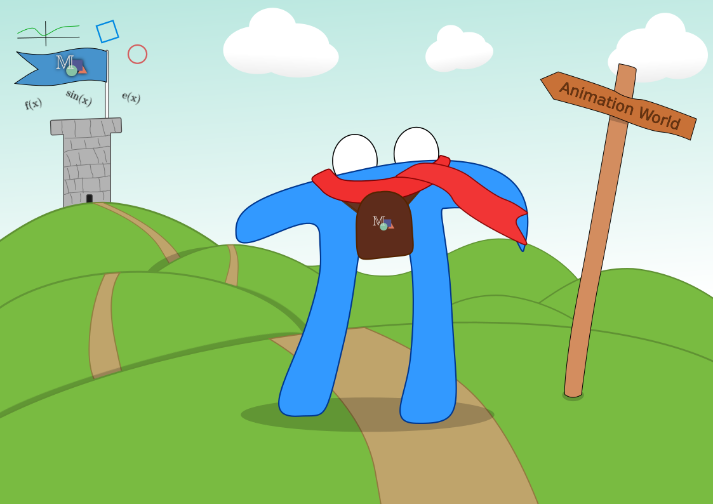

***************
A Basic Project
***************

**Authors:** `Tristan Schulz <https://github.com/MrDiver>`__ and `Aarush Deshpande <https://github.com/JasonGrace2282>`__

.. note:: This is a work in progress guide and might not be complete at this point

############
Introduction
############
Throughout this guide, we'll walk you through how to create a simple 30 second video about vector addition. If you don't
already know what that is, it's recommended you watch `this <https://youtu.be/fNk_zzaMoSs?si=fQDML214IeNl0OZ1>`_ video
by the original creator of manim, 3Blue1Brown.

The next step is figuring out how the project should look: what content should it cover, in what order, etc. In this
tutorial, we'll focus on two parts of vector addition: the algebraic way, and the geometric way. For the algebraic way,
we'll show two vectors (as matrices) being added, and give a short explanation. After that we'll show the typical tip-to-tail
method for adding vectors graphically. Of course, choosing good examples is very important to help the viewer understand.
In our case, we'll use the two vectors :math:`v_1\equiv\langle 2, 1\rangle` and :math:`v_2\equiv\langle 0,-3 \rangle`.

################
Vector Addition
################

We'll start with the basic setup needed for every manim video.
To do this, we can use the manim cli to speed stuff up. In the terminal,
run::

  manim init project VectorAddition

This should create a folder called ``VectorAddition`` with the basic setup.

.. hint::

   You may want to open this folder in your IDE (like VS Code, or PyCharm).

You will have a ``manim.cfg`` file, where you configuration will be stored, and a ``main.py`` script.
The ``main.py`` script is where you will write your scenes.

If you did it correctly, running the python file with ``manim -p main.py`` should render a scene
with a circle being created:

.. manim:: CreateCircle
   :hide_source:

   class CreateCircle(Scene):
      def construct(self):
          circle = Circle()
          circle.set_fill(PINK, opacity=0.5)

          square = Square()
          square.flip(RIGHT)
          square.rotate(-3 * TAU / 8)

          self.play(Create(square))
          self.play(Transform(square, circle))
          self.play(FadeOut(square))

============
Introduction
============
First we need to introduce the viewer to what we're going to talk about. Ideally,
it would be an interesting hook, but for the sake of learning the library we will
stick with a simple text-based intro. Try to recreate the following:

.. manim:: AdventureIntro
    :hide_source:
    :ref_classes: Tex Text Write Unwrite Create

    class AdventureIntro(Scene):
        def construct(self):
            intro = Text("Let's try to add two vectors!")
            # put an r"" instead of a normal string so we don't have any special characters like \n
            vec_txts = Tex(r"We'll use $\boldsymbol{\vec{v}_1}=(2, 2)$ and $\boldsymbol{\vec{v}_2}=(0, -3)$")
            self.play(Create(intro))
            self.wait(1)
            # "grey out" the intro and shift it upwards as we write the second line
            self.play(intro.animate.shift(2*UP).set_opacity(0.5), Write(vec_txts))
            self.wait(1)
            self.play(Unwrite(intro), Unwrite(vec_txts), run_time=.5)
            self.wait(0.2)

.. admonition:: Authors solution
    :class: dropdown
        
    .. code-block:: python

        class AdventureIntro(Scene):
            def construct(self):
                intro = Text("Let's try to add two vectors!")
                # put an r"" instead of a normal string so we don't have any special characters like \n
                vec_txts = Tex(
                    r"We'll use $\boldsymbol{\vec{v}_1}=(2, 2)$ and $\boldsymbol{\vec{v}_2}=(0, -3)$"
                )
                self.play(Create(intro))
                self.wait(1)
                # "grey out" the intro and shift it upwards as we write the second line
                self.play(intro.animate.shift(2 * UP).set_opacity(0.5), Write(vec_txts))
                self.wait(1)
                self.play(Unwrite(intro), Unwrite(vec_txts), run_time=0.5)
                self.wait(0.2)

============================
Algebraic vector addition
============================

Then, let's show the viewer how vector addition between two vectors is done algebraically.
Once again, try to recreate the following:

.. manim:: AlgebraicAddition
    :hide_source:
    :ref_classes: Title MathTex Paragraph Tex Text Write Unwrite Create FadeIn
    
    class AlgebraicAddition(Scene):

        def construct(self):
            title = Title("Vector Addition Algebraically")

            v1x, v1y = (2, 2)
            v2x, v2y = (0, -3)
            math = MathTex(r"""
                \begin{bmatrix} %(v1x)d \\ %(v1y)d \end{bmatrix}
                +\begin{bmatrix} %(v2x)d \\ %(v2y)d \end{bmatrix}
            """ % {
                'v1x': v1x,
                'v2x': v2x,
                'v1y': v1y,
                'v2y': v2y
            }).shift(DOWN)

            resultant_vector = r"=\begin{bmatrix} %(x)d \\ %(y)d \end{bmatrix}" % {
                'x': v1x+v2x,
                'y': v1y+v2y
            }
            math_with_answer = MathTex(
                math.get_tex_string()+resultant_vector
            ).move_to(math.get_center())

            self.play(Write(math), FadeIn(title))
            self.wait(2)
            self.play(
                math.animate.shift(2*UP).set_opacity(0.5),
                Write(math_with_answer)
            )
            conclusion = Paragraph("As you can see,\nYou add each component individually").to_edge(DOWN)
            self.play(Write(conclusion))
            self.wait(2)
            self.play(Unwrite(math), Unwrite(math_with_answer), Unwrite(conclusion), Unwrite(title))

Hints
-----

Use :class:`.Title` to display the title at the top of the Scene.

Use :class:`.MathTex` to represent the matrices, try not to hardcode the values into the LaTeX string, instead, use python string formatting, this will allow us to define the resultant vector dynamically.

.. code-block:: python

    v1x, v1y = (2, 2)
    v2x, v2y = ...
    math = MathTex(r"""
                ... %(v1x)d \\ %(v1y)d ...
                + ... %(v2x)d \\ %(v2y)d ...
            """ % {
                'v1x': v1x,
                'v2x': v2x,
                'v1y': v1y,
                'v2y': v2y
            })

.. admonition:: Authors solution
    :class: dropdown
        
    .. code-block:: python

        class AlgebraicAddition(Scene):

            def construct(self):
                title = Title("Vector Addition Algebraically")

                v1x, v1y = (2, 2)
                v2x, v2y = (0, -3)
                math = MathTex(r"""
                    \begin{bmatrix} %(v1x)d \\ %(v1y)d \end{bmatrix}
                    +\begin{bmatrix} %(v2x)d \\ %(v2y)d \end{bmatrix}
                """ % {
                    'v1x': v1x,
                    'v2x': v2x,
                    'v1y': v1y,
                    'v2y': v2y
                }).shift(DOWN)

                resultant_vector = r"=\begin{bmatrix} %(x)d \\ %(y)d \end{bmatrix}" % {
                    'x': v1x+v2x,
                    'y': v1y+v2y
                }
                math_with_answer = MathTex(
                    math.get_tex_string()+resultant_vector
                ).move_to(math.get_center())

                self.play(Write(math), FadeIn(title))
                self.wait(2)
                self.play(
                    math.animate.shift(2*UP).set_opacity(0.5),
                    Write(math_with_answer)
                )
                conclusion = Paragraph("As you can see,\nYou add each component individually").to_edge(DOWN)
                self.play(Write(conclusion))
                self.wait(2)
                self.play(Unwrite(math), Unwrite(math_with_answer), Unwrite(conclusion), Unwrite(title))

============================
Geometric vector addition
============================

Lastly, let's show the vector addition geometrically, let's reproduce the following:

.. manim:: GeometricAddition
    :hide_source:
    :ref_classes: Title MathTex Paragraph Tex Text Write Unwrite Create FadeIn NumberPlane Arrow AnimationGroup ReplacementTransform VGroup
    
    class VectorGroup(VGroup):
        def __init__(
            self, start, end, labelname: str,
            vector_color: ParsableManimColor, direction = RIGHT,
            plane: NumberPlane | None = None, **kwargs
        ) -> None:
            if plane is not None:
                # if using a plane convert from plane units
                # to Munits
                start = plane.c2p(*start)
                end = plane.c2p(*end)

            self.vector = Arrow(
                start,
                end,
                color=vector_color,
                buff=0
            )
            self.label = MathTex(labelname, color=vector_color)

            def label_updater(m: MathTex, d=direction):
                m.next_to(self.vector, direction=d, **kwargs)

            self.label.add_updater(label_updater, call_updater=True)
            super().__init__(self.vector, self.label, **kwargs)

        @override_animation(Create)
        def _create_vec_write_label(self) -> AnimationGroup:
            return AnimationGroup(
                Create(self.vector),
                Write(self.label),
                lag_ratio=0
            )

        @override_animation(Uncreate)
        def _uncreate_vec_unwrite_label(self) -> AnimationGroup:
            return AnimationGroup(
                Uncreate(self.vector),
                Unwrite(self.label),
                lag_ratio=0
            )

    class GeometricAddition(Scene):
        def construct(self):
            title = Text("Now let's take a look at it geometrically")
            self.play(Write(title))
            self.wait(2)
            self.play(Unwrite(title))

            plane = NumberPlane()

            sum_point = (2, -1, 0)

            v1 = VectorGroup(
                ORIGIN,
                (2, 2, 0),
                r"\boldsymbol{\vec{v}_1}",
                RED,
                direction=UP,
                plane=plane
            )

            v2 = VectorGroup(
                ORIGIN,
                (0, -3, 0),
                r"\boldsymbol{\vec{v}_2}",
                YELLOW,
                direction=LEFT,
                plane=plane
            )

            v1moved = VectorGroup(
                (0, -3, 0),
                sum_point,
                r"\boldsymbol{\vec{v}_1}",
                v1.vector.get_color(),
                plane=plane
            )

            v2moved = VectorGroup(
                (2, 2, 0),
                sum_point,
                r"\boldsymbol{\vec{v}_2}",
                v2.vector.get_color(),
                plane=plane
            )

            sum_vec = VectorGroup(
                ORIGIN,
                sum_point,
                r"\boldsymbol{\vec{v}_1}+\boldsymbol{\vec{v}_2}",
                ORANGE,
                direction=DOWN,
                plane=plane
            )

            self.play(Create(plane), Create(v1))
            self.wait(0.5)
            self.play(Create(v2))
            self.wait()

            # animate movement of vectors
            self.play(
                Succession(
                    ReplacementTransform(v1.copy(), v1moved),
                    ReplacementTransform(v2.copy(), v2moved)
                )
            )
            self.wait()
            # draw sum vector
            self.play(Create(sum_vec))
            self.wait()
            self.play(*[
                Uncreate(x)
                for x in (
                    plane,
                    v1,
                    v2,
                    v1moved,
                    v2moved,
                    sum_vec
                )
            ])

Hints
-----

Use :class:`.NumberPlane` to define the cartesian plane.

Use :class:`.Arrow` for the vectors.

To make sure the label of the vector and the vector shift together, you can define a custom :class:`.VGroup` class.

.. admonition:: Authors solution
    :class: dropdown
        
    .. code-block:: python

        class VectorGroup(VGroup):
            def __init__(
                self, start, end, labelname: str,
                vector_color: ParsableManimColor, direction = RIGHT,
                plane: NumberPlane | None = None, **kwargs
            ) -> None:
                if plane is not None:
                    # if using a plane convert from plane units
                    # to Munits
                    start = plane.c2p(*start)
                    end = plane.c2p(*end)

                self.vector = Arrow(
                    start,
                    end,
                    color=vector_color,
                    buff=0
                )
                self.label = MathTex(labelname, color=vector_color)

                def label_updater(m: MathTex, d=direction):
                    m.next_to(self.vector, direction=d, **kwargs)

                self.label.add_updater(label_updater, call_updater=True)
                super().__init__(self.vector, self.label, **kwargs)

            @override_animation(Create)
            def _create_vec_write_label(self) -> AnimationGroup:
                return AnimationGroup(
                    Create(self.vector),
                    Write(self.label),
                    lag_ratio=0
                )

            @override_animation(Uncreate)
            def _uncreate_vec_unwrite_label(self) -> AnimationGroup:
                return AnimationGroup(
                    Uncreate(self.vector),
                    Unwrite(self.label),
                    lag_ratio=0
                )

        class GeometricAddition(Scene):
            def construct(self):
                title = Text("Now let's take a look at it geometrically")
                self.play(Write(title))
                self.wait(2)
                self.play(Unwrite(title))

                plane = NumberPlane()

                sum_point = (2, -1, 0)

                v1 = VectorGroup(
                    ORIGIN,
                    (2, 2, 0),
                    r"\boldsymbol{\vec{v}_1}",
                    RED,
                    direction=UP,
                    plane=plane
                )

                v2 = VectorGroup(
                    ORIGIN,
                    (0, -3, 0),
                    r"\boldsymbol{\vec{v}_2}",
                    YELLOW,
                    direction=LEFT,
                    plane=plane
                )

                v1moved = VectorGroup(
                    (0, -3, 0),
                    sum_point,
                    r"\boldsymbol{\vec{v}_1}",
                    v1.vector.get_color(),
                    plane=plane
                )

                v2moved = VectorGroup(
                    (2, 2, 0),
                    sum_point,
                    r"\boldsymbol{\vec{v}_2}",
                    v2.vector.get_color(),
                    plane=plane
                )

                sum_vec = VectorGroup(
                    ORIGIN,
                    sum_point,
                    r"\boldsymbol{\vec{v}_1}+\boldsymbol{\vec{v}_2}",
                    ORANGE,
                    direction=DOWN,
                    plane=plane
                )

                self.play(Create(plane), Create(v1))
                self.wait(0.5)
                self.play(Create(v2))
                self.wait()

                # animate movement of vectors
                self.play(
                    Succession(
                        ReplacementTransform(v1.copy(), v1moved),
                        ReplacementTransform(v2.copy(), v2moved)
                    )
                )
                self.wait()
                # draw sum vector
                self.play(Create(sum_vec))
                self.wait()
                self.play(*[
                    Uncreate(x)
                    for x in (
                        plane,
                        v1,
                        v2,
                        v1moved,
                        v2moved,
                        sum_vec
                    )
                ])

################
The Final Result
################
Putting it all together, we can render the final result.

.. include:: vector_addition.rst
