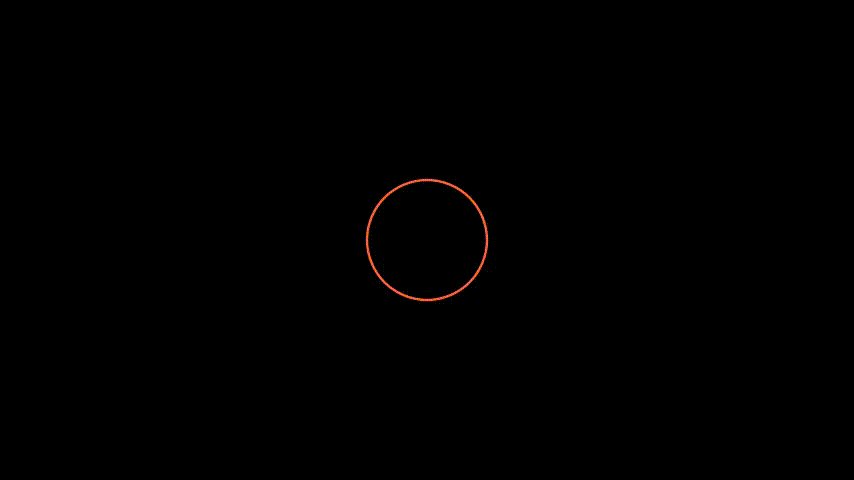
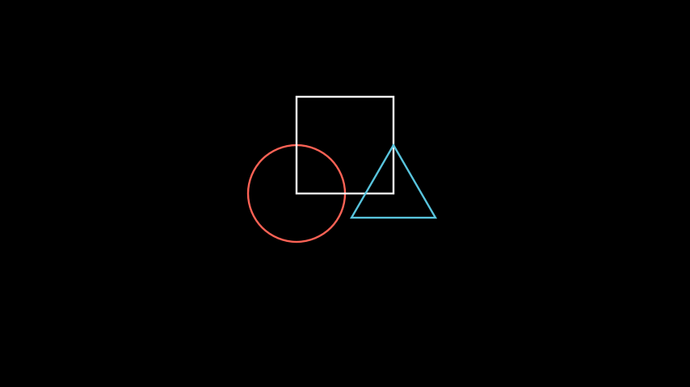
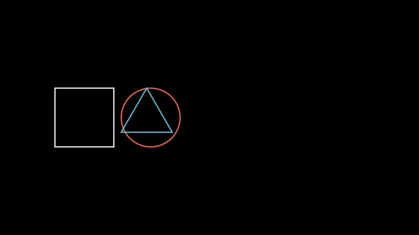

#######################
Manim's building blocks
#######################

This document explains the building blocks of manim and will give you all the
necessary tools to start producing your own videos.

.. note:: It is recommended that you read the tutorials :doc:`quickstart` and
          :doc:`a_deeper_look` before reading this page.

Essentially, manim puts at your disposal three different concepts that you can
orchestrate together in order to produce mathematical animations: the
**mathematical object** (or **mobject** for short) the **animation**, and the
**scene**.  As we will see in the following sections, each of these three
concepts is implemented in manim as a separate class: the :class:`.Mobject`,
:class:`.Animation`, and :class:`.Scene` classes.

********
Mobjects
********

Mobjects are the basic building block for all manim animations.  Each class
that derives from :class:`.Mobject` represents an object that can be displayed
on screen.  For example, simple shapes such as :class:`.Circle`,
:class:`.Arrow`, and :class:`.Rectangle` are all mobjects.  More complicated
constructs such as :class:`.Axes`, :class:`.FunctionGraph`, or
:class:`.BarChart` are mobjects as well.

If you try to display on screen an instance of :class:`.Mobject`, you will only
see an empty frame.  The reason is that the :class:`.Mobject` class is an
abstract base class of all other mobjects, i.e. it does not have any
pre-determined visual shape that can be displayed on screen.  It is only the
skeleton of a thing that *could* be displayed.  Therefore, you will rarely need
to use plain instances of :class:`.Mobject`; instead you will most likely
create instances of its derived classes.

.. note:: Any object that can be displayed on screen is a ``mobject``, even if
          it is not necessarily *mathematical* in nature.

.. tip:: To see examples of classes derived from :class:`.Mobject`, see the
         :mod:`.geometry` module.

Creating and displaying mobjects
================================

As explained in the :doc:`quickstart`, usually all of the code in a manim
script is put inside the :meth:`.construct` method of a :class:`.Scene` class.
To display a mobject on the screen, call the :meth:`~.Scene.add` method of the
containing :class:`.Scene`.  This is the principal way of displaying a mobject
on the screen when it is not being animated.  To remove a mobject from the
screen, simply call the :meth:`~.Scene.remove` method from the containing
:class:`.Scene`.

.. code-block:: python

   class AddRemove(Scene):
       def construct(self):
           circle = Circle()
           self.add(circle)
           self.wait(1)
           self.remove(circle)
           self.wait(1)

Placing mobjects
================

Let's define a new :class:`.Scene` called ``Shapes`` and :meth:`~.Scene.add`
some mobjects to it.

.. code-block:: python

   class Shapes(Scene):
       def construct(self):
           circle = Circle()
           square = Square()
           triangle = Triangle()

           circle.shift(LEFT)
           square.shift(UP)
           triangle.shift(RIGHT)

           self.add(circle, square, triangle)
           self.wait(1)

This script generates a static picture that displays a circle, a square, and a
triangle:

By default, mobjects are placed at the center of coordinates, or *origin*, when
they are first created.  They are also given some default colors.  Further, the
``Shapes`` scene places the mobjects by using the :meth:`.shift` method.  The
square is shifted one unit in the ``UP`` direction from the origin, while the
circle and triangle are shifted one unit ``LEFT`` and ``RIGHT``, respectively.

.. note:: Unlike other graphics software, manim places the center of
          coordinates at the center of the screen.  The positive vertical
          direction is up, and the positive horizontal direction is right.  See
          also the constants ``ORIGIN``, ``UP``, ``DOWN``, ``LEFT``, ``RIGHT``,
          and others, defined in the :mod:`.constants` module.

There are many other possible ways to place mobjects on the screen, for example
:meth:`.move_to`, :meth:`.next_to`, and :meth:`.align_to`.  The next scene
``Shapes2`` uses all three.

.. code-block:: python

   class Shapes2(Scene):
       def construct(self):
           circle = Circle()
           square = Square()
           triangle = Triangle()

           # place the circle two units left from the origin
           circle.move_to(LEFT * 2)
           # place the square to the left of the circle
           square.next_to(circle, LEFT)
           # align the left border of the triangle to the left border of the circle
           triangle.align_to(circle, LEFT)

           self.add(circle, square, triangle)
           self.wait(1)

The :meth:`.move_to` method uses absolute units (measured relative to the
``ORIGIN``), while :meth:`.next_to` uses absolute units (measured from the
mobject passed as the first argument).  :meth:`align_to` uses ``LEFT`` not as
measuring units but as a way to determine the border to use for alignment.  The
coordinates of the borders of a mobject are determined using an imaginary
bounding box around it.

.. tip:: Many methods in manim can be chained together.  For example the two
         lines

         .. code-block:: python

            square = Square()
            square.shift(LEFT)

         can be replaced by

         .. code-block:: python

            square = Square().shift(LEFT)

**********
Animations
**********

******
Scenes
******
